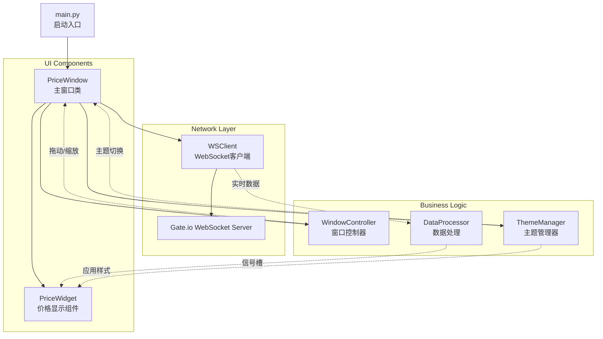
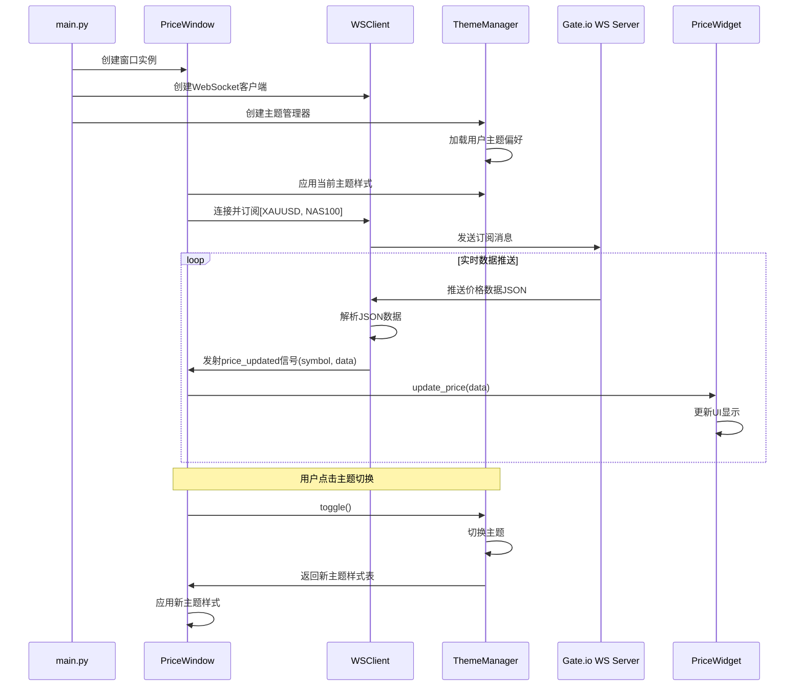
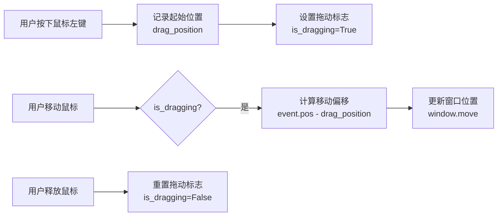

# Windows 桌面价格浮窗工具 - 架构设计

## 项目概述
一个实时显示 XAUUSD 和 NAS100 价格的 Windows 桌面浮窗工具，基于 PyQt6 实现。
支持深色/浅色主题切换、窗口拖动和自定义大小。

## 技术栈
- **GUI框架**: PyQt6
- **WebSocket**: websocket_client (复用demo.py中的库)
- **JSON处理**: Python内置json模块
- **多线程**: PyQt6信号槽机制（避免阻塞UI）
- **样式管理**: QSS样式表

## 系统架构图



## 文件结构

```
gateTracker/
├── main.py                 # 程序启动入口
├── window.py               # 主窗口类（PriceWindow）
├── ws_client.py            # WebSocket客户端封装
├── price_widget.py         # 单个交易对价格显示组件
├── theme_manager.py        # 主题管理器
├── requirements.txt        # 依赖包列表
├── demo.py                 # 原始demo代码（参考）
└── plans/
    └── architecture.md     # 本架构文档
```

## 核心模块设计

### 1. main.py - 启动入口
**职责**: 应用程序初始化和启动
- 创建QApplication实例
- 初始化并显示主窗口
- 启动事件循环

### 2. window.py - 主窗口类（PriceWindow）
**职责**: 主窗口管理和UI布局
**关键功能**:
- 设置窗口为无边框、置顶显示
- 实现窗口拖动（鼠标事件处理）
- 实现窗口大小调整（支持配置）
- 创建右键菜单（退出、切换主题、设置等）
- 布局管理（垂直布局显示多个价格组件）

**关键属性**:
```python
- is_dragging: bool          # 拖动状态
- drag_position: QPoint      # 拖动起始位置
- size_config: dict         # 窗口大小配置
- theme_manager: ThemeManager # 主题管理器实例
```

**关键方法**:
```python
+ mousePressEvent(event)     # 记录拖动起始位置
+ mouseMoveEvent(event)      # 执行窗口拖动
+ mouseReleaseEvent(event)   # 结束拖动
+ set_window_size(width, height)  # 设置窗口大小
+ update_price(symbol, data)       # 更新价格显示
+ toggle_theme()                   # 切换深色/浅色主题
+ apply_theme_stylesheet()         # 应用主题样式表
```

### 3. ws_client.py - WebSocket客户端
**职责**: WebSocket连接管理和消息处理
**关键功能**:
- 建立WebSocket连接
- 发送订阅消息
- 持续接收并处理服务器推送
- 通过PyQt信号将数据传递给UI

**关键信号**:
```python
price_updated = pyqtSignal(str, dict)  # 更新价格信号
connection_lost = pyqtSignal()          # 连接丢失信号
```

**关键方法**:
```python
+ connect()                    # 连接WebSocket
+ subscribe(markets)           # 订阅市场数据
+ receive_messages()           # 接收消息循环
+ parse_message(message)       # 解析消息
```

### 4. price_widget.py - 价格显示组件
**职责**: 单个交易对的价格信息显示
**关键功能**:
- 显示交易对名称（XAUUSD/NAS100）
- 显示当前价格
- 显示涨跌幅（颜色区分涨跌）
- 显示最高价和最低价
- 美观的UI样式（支持涨跌颜色变化）
- 支持主题样式动态应用

**关键属性**:
```python
- symbol: str                  # 交易对符号
- last_price: float          # 最新价格
- price_change_rate: float   # 涨跌幅
- theme: Theme                # 当前主题
```

**关键方法**:
```python
+ update_price(data)          # 更新价格数据
+ get_color_for_change(rate)  # 根据涨跌幅返回颜色
+ set_theme(theme)            # 应用主题
```

### 5. theme_manager.py - 主题管理器
**职责**: 主题样式管理和切换
**关键功能**:
- 定义深色主题样式表
- 定义浅色主题样式表
- 保存用户主题偏好
- 提供主题切换接口

**关键属性**:
```python
- current_theme: str          # 当前主题 'dark'/'light'
- stylesheets: dict          # 主题样式表字典
```

**关键方法**:
```python
+ get_stylesheet(theme)       # 获取指定主题的样式表
+ toggle()                    # 切换主题并返回新主题
+ load_user_preference()      # 加载用户主题偏好
+ save_user_preference()      # 保存用户主题偏好
```

## 数据流程图



## 窗口拖动实现原理



## UI布局设计

```
┌──────────────────────────────────┐
│  右键菜单区域（可拖动）         │
├──────────────────────────────────┤
│  XAUUSD                          │

│  当前价: 4622.95                 │
│  涨跌幅: +0.78% (绿色)           │
│  高: 4625.59  低: 4587.07       │
├──────────────────────────────────┤
│  NAS100                          │
│  当前价: 19850.25               │
│  涨跌幅: -1.23% (红色)           │
│  高: 19900.50  低: 19780.00     │
└──────────────────────────────────┘
```

## 主题设计

### 深色主题（Dark Theme）
```css
背景色: #1e1e1e
文字颜色: #e0e0e0
边框颜色: #333333
价格标签颜色: #aaaaaa
涨颜色: #00ff00（亮绿）
跌颜色: #ff4444（亮红）
分隔线颜色: #333333
悬停背景色: #2d2d2d
```

### 浅色主题（Light Theme）
```css
背景色: #ffffff
文字颜色: #333333
边框颜色: #e0e0e0
价格标签颜色: #666666
涨颜色: #00aa00（深绿）
跌颜色: #cc0000（深红）
分隔线颜色: #eeeeee
悬停背景色: #f5f5f5
```

## 关键特性实现

### 1. 窗口拖动
- 继承QMainWindow或QWidget
- 重写mousePressEvent、mouseMoveEvent、mouseReleaseEvent
- 使用QWidget.move()实现窗口移动

### 2. 窗口大小设置
- 默认大小: 300x200
- 可通过配置文件或右键菜单调整
- 支持固定比例或自定义尺寸

### 3. 实时价格更新
- 使用QThread在后台运行WebSocket接收循环
- 使用pyqtSignal将数据传递到主线程
- UI更新在主线程中执行（线程安全）

### 4. 涨跌颜色显示
- 涨（price_change_rate > 0）: 绿色
- 跌（price_change_rate < 0）: 红色
- 平（price_change_rate = 0）: 白色/灰色

### 5. 主题切换
- 右键菜单添加"切换主题"选项
- 使用QSS样式表实现主题样式
- 主题偏好保存到本地配置文件
- 切换时动态应用新样式到所有组件

## 右键菜单设计

```
┌────────────────────────────┐
│ 切换主题    Ctrl+T        │
│ 设置窗口大小...           │
├────────────────────────────┤
│ 退出        Ctrl+Q        │
└────────────────────────────┘
```

## 配置文件设计

### user_config.json
```json
{
    "window": {
        "width": 300,
        "height": 200,
        "always_on_top": true,
        "position": {
            "x": 100,
            "y": 100
        }
    },
    "theme": {
        "current": "dark",
        "auto_switch": false
    },
    "markets": ["XAUUSD", "NAS100"],
    "websocket": {
        "url": "wss://fx-ws.gateio.ws/v4/ws/tradfi"
    }
}
```

## 扩展性考虑

### 未来可能的功能
1. 添加更多交易对
2. 价格历史图表
3. 价格提醒功能（高于/低于某值）
4. 窗口透明度调节
5. 数据缓存和重连机制
6. 多语言支持

## 依赖项

```txt
PyQt6>=6.5.0
websocket-client>=1.6.0
```

## 安装和运行

```bash
# 安装依赖
pip install -r requirements.txt

# 运行程序
python main.py
```

## 注意事项

1. **线程安全**: WebSocket接收在独立线程中，UI更新必须通过信号槽
2. **异常处理**: 处理网络断开、消息解析异常等情况
3. **资源释放**: 程序退出时正确关闭WebSocket连接
4. **样式管理**: 使用QSS样式表实现主题切换，确保所有组件应用统一样式
5. **配置持久化**: 用户偏好（窗口位置、大小、主题）自动保存和加载
